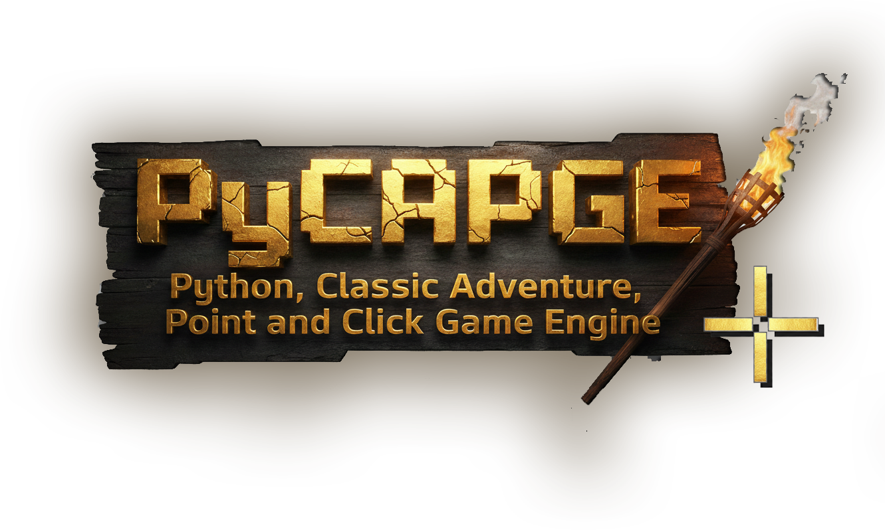

PyCAPGE - Python Classic Adventure Point and Click Game Engine



PyCAPGE is a free and open source engine for creating Classic point-and-click graphic adventures, written in Python. This project is released as copyleft software. 

PLAYERS
==================================================================
- F1 : Help mode
- F2 : Menu ( on - off )
- F11: Full Screen
- Double click to change screen ( left o right)
- Click in dialogue to fast mode
- ESC on dialogue to exit

PROGRAMMERS
==================================================================
Configure the script to your liking, then create your adventure scenes in /scenes. You can use the intro, ending, or create entirely new scene. Use global variables to ensure that saving games is effective across all languages

- Read the manual / documentation
- F1 : Help mode
- F2 : Menu ( on - off )
- F3 : Debug mode
- F4 : show walkeable map
- F11: Full Screen
- Configure the engine in config.py
- Place Your: variables, intro, ending, and scenes in the /scenes/ directory
- Source code is available and modifiable

```text
(root)
│
├── __pycache__/         <-- Cache storage
├── backgrounds/         <-- Walkable and environment backgrounds
├── cursor/              <-- Cursor graphics
├── fonts/               <-- Typography (Free fonts) - International -
├── games/               <-- Saved games (Save files)
├── hotspots/            <-- Interactive area definitions. General objects.
├── items/               <-- NPC sprite sheets
├── languages/           <-- Translation files (YAML)
├── objects/             <-- Inventory images (different from hotspots)
├── snd/                 <-- Sound effects and music
├── tutorial/            <-- Tutorial resources 
│
├── engine/              <-- ENGINE LOGIC
│   ├── __init__.py
│   ├── classes.py
│   └── resources.py
│
├── scenes/              <-- SCENE MANAGEMENT
│   ├── __init__.py
│   ├── scenes.py
│   ├── intro.py
│   ├── ending.py
│   └── variables.py
│
├── main.py              <-- Entry point
└── config.py            <-- General configuration


GAMES CREATED WITH PyCAPGE
==================================================================
Any game created using PyCAPGE, including its source code or runtime, is considered a derivative work of the engine.
Therefore:
- Games created with PyCAPGE MUST be released under GPL-3.0-or-later.
- The complete source code of the game must be made available.
- Closed-source or proprietary games are NOT permitted.

FORKS & REDISTRIBUTION
==================================================================
- Forks are welcome, but we especially encourage collaboration and direct contributions.
- Modified versions may be redistributed.
- All redistributions must comply with GPL-3.0-or-later.
- The original author credit must be preserved.
- Derived works must remain under the same license.

ATTRIBUTION
==================================================================
If you distribute or publish modified versions of this engine or games created with it, you must keep the following attribution:
"PyCAPGE - Python Classic Adventure Point and Click Game Engine Copyright (c) 2025 Garba"
This attribution must appear in the source code and documentation.

LICENSE
==================================================================
Copyleft © 2025-2025 Garba
https://eduardogarbayo.com
This program is free software: you can redistribute it and/or Modify it under the terms of the GNU General Public License as published by the Free Software Foundation, either version 3 of the License, or (at your option) any later version.
SPDX-License-Identifier: GPL-3.0-or-later
A copy of the GNU General Public License must be included in the file LICENSE distributed with this project.

DONATIONS
==================================================================
If you want to support the development of PyCAPGE, you can donate at:
https://www.zainder.com/donations/
==================================================================
